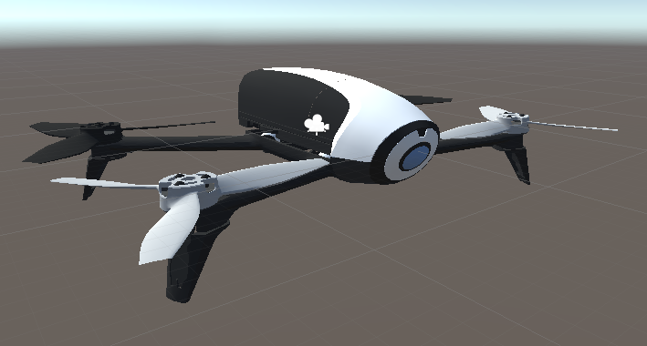

# Introduction

[Check out the video](https://youtu.be/XajgNfNJ1VI)

The drone mesh is the one provided by tum-simulator[1], in particular, the quadrotor meshes in the cvg_sim_gazebo directory. The URDF file has been imported with the URDFImporter of ros-sharp [2]

The control is very naïve. It's using a PID controller with absolutely no knowledge about the true dynamics of the drone. It is just regulating the forces of the propellers in order to minimize an error. Four PID controllers are used :
1) for the altitude, which seeks to minimize an error in position, with a target moving at a desired velocity. It provides a force to the propellers
2) for the pitch, roll : which seek to minimize an error in velocity. It provides a force to the propellers
3) for the yaw which seek to minimize an error in angular velocity. It provides a torque on the object.

A third person camera is tracking the drone from behind.

The drone is equiped with a camera which can be stabilized, i.e. compensate for the pitch and roll of the drone in order to stay horizontal.

If you want to test the drone, take an empty scene, drag and drop the Drone prefab. Then create an empty object and add the "KeyToCmdVel" script. You can then move the drone with the up/down/left/right arrows, pageup/pagedown and w/x for the yaw.

[1] https://github.com/tum-vision/tum_simulator
[2] https://github.com/siemens/ros-sharp/

# Using the drone with Unity3D 2018.1.0f2 and ROS kinetic

If you want to use the drone within Unity3D and interface it with ROS, you should do :

1. Import the unitypackage asset within Unity3D
1. Import the ros sharp release 1.2a unitypackage asset from [3]
1. Drag and drop the Drone/DroneRos prefab
1. Create an empty object and add a RosSharp/Scripts/RosCommunication/RosConnector component to it. Set the Ros bridge server URL attribute to your localhost **ws://127.0.0.1:9090**
1. Drag and drop a RosSharp/Scripts/RosCommunications/UnityTimePublisher component to your RosConnector; Set the topic to **/drone/image/compressed**
1. Assign your camera of your instance of the DroneRos prefab to the UnityTimePublisher/Message provider attribute
1. Do the previous 2 steps for the ThirdPersonCamera  of your instance of DroneRos, and set the topic of the publisher to **/drone/3rdview/compressed**
1. Drag and drone a RosSharp/Scripts/RosCommunication/Subscriber to your RosConnector. Set the topic to **/drone/cmd_vel**  and assign your instance of DroneRos  to the MessageReceiver

You can now roslaunch the test.launch script in this repository and then start the game within unity3D;

You should get two image topics (see with rqt_image_view)  and a Twist topic on /drone/cmd_vel on which you can post your commands.

[3]  https://github.com/siemens/ros-sharp/releases